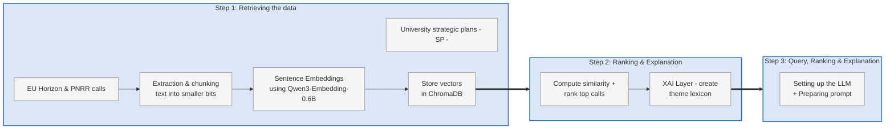

# EY-AI-Techniques-Solution

```mermaid
flowchart LR
    subgraph S1 [Step 1: Retrieving the data]
        EU[EU Horizon & PNRR calls]
        SP[University strategic plans - SP -]
        EU --> EX[Extraction & chunking\ntext into smaller bits]
        EX --> EMB[Sentence Embeddings\nusing Qwen3-Embedding-0.6B]
        EMB --> VDB[Store vectors\nin ChromaDB]
    end

    subgraph S2 [Step 2: Ranking & Explanation]
        RANK[Compute similarity +\nrank top calls]
        RANK --> XAI[XAI Layer - create\ntheme lexicon]
    end

    subgraph S3 [Step 3: Query, Ranking & Explanation]
        LLM[Setting up the LLM\n+ Preparing prompt]
    end

    VDB ==> S2
    XAI ==> S3

    classDef step    fill:#dce8f7,stroke:#2c6fad,stroke-width:2px;
    classDef process fill:#f5f5f5,stroke:#aaaaaa,stroke-width:1.5px;
    class S1,S2,S3 step;
    class EU,SP,EX,EMB,VDB,RANK,XAI,LLM process;
```

