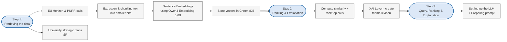

# EY-AI-Techniques-Solution

```mermaid
flowchart LR
    %% Step 1: Retrieving the data
    S1([Step 1:\nRetrieving the data])
    S1 --> EU[EU Horizon & PNRR calls]
    S1 --> SP[University strategic plans\n- SP -]
    EU --> EX[Extraction & chunking text\ninto smaller bits]
    EX --> EMB[Sentence Embeddings\nusing Qwen3-Embedding-0.6B]
    EMB --> VDB[Store vectors in ChromaDB]

    %% Step 2: Ranking & Explanation
    VDB ==> S2([Step 2:\nRanking & Explanation])
    S2 --> RANK[Compute similarity +\nrank top calls]
    RANK --> XAI[XAI Layer - create\ntheme lexicon]

    %% Step 3: Query, Ranking & Explanation
    XAI ==> S3([Step 3:\nQuery, Ranking & Explanation])
    S3 --> LLM[Setting up the LLM\n+ Preparing prompt]

    classDef step    fill:#dce8f7,stroke:#2c6fad,stroke-width:2px;
    classDef process fill:#f5f5f5,stroke:#888888,stroke-width:1.5px;

    class S1,S2,S3 step;
    class EU,SP,EX,EMB,RANK,XAI,LLM,VDB process;
```
