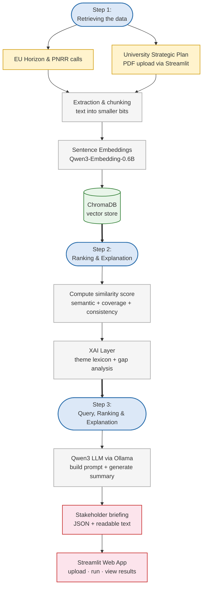

# EY-AI-Techniques-Solution

```mermaid
flowchart TD
    S1([Step 1:\nRetrieving the data])

    S1 --> EU[EU Horizon & PNRR calls]
    S1 --> SP[University Strategic Plan\nPDF upload via Streamlit]

    EU --> EX
    SP --> EX
    EX[Extraction & chunking\ntext into smaller bits]
    EX --> EMB[Sentence Embeddings\nQwen3-Embedding-0.6B]
    EMB --> VDB[(ChromaDB\nvector store)]

    VDB ==> S2([Step 2:\nRanking & Explanation])
    S2 --> RANK[Compute similarity score\nsemantic + coverage + consistency]
    RANK --> XAI[XAI Layer\ntheme lexicon + gap analysis]

    XAI ==> S3([Step 3:\nQuery, Ranking & Explanation])
    S3 --> LLM[Qwen3 LLM via Ollama\nbuild prompt + generate summary]
    LLM --> OUT[Stakeholder briefing\nJSON + readable text]
    OUT --> WEB[Streamlit Web App\nupload · run · view results]

    classDef step    fill:#dce8f7,stroke:#2c6fad,stroke-width:2px;
    classDef data    fill:#fff3cd,stroke:#d4a017,stroke-width:1.5px;
    classDef process fill:#f5f5f5,stroke:#aaaaaa,stroke-width:1.5px;
    classDef db      fill:#e8f5e9,stroke:#2e7d32,stroke-width:1.5px;
    classDef output  fill:#fce4ec,stroke:#c62828,stroke-width:1.5px;

    class S1,S2,S3 step;
    class EU,SP data;
    class EX,EMB,RANK,XAI,LLM process;
    class VDB db;
    class OUT,WEB output;
```
